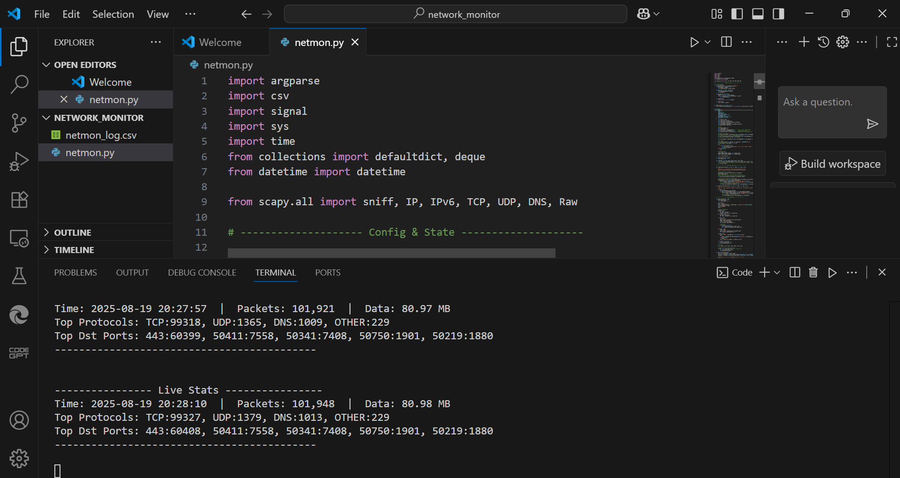

# Network Monitor (NetMon)

A lightweight Python-based **network monitoring tool** that captures live packets, logs traffic, and provides protocol/port statistics in real-time.  

---

## Features
- 📡 Live packet sniffing using **Scapy**
- 📊 Tracks **protocol usage** (TCP, UDP, DNS, etc.)
- 🔍 Shows **top destination ports**
- 📝 Logs all activity into a CSV file
- 🚨 Configurable port scanning & SSH brute-force detection

---

## Installation
1. Clone the repository:
   ```bash
   git clone https://github.com/ramkrishna633/netmon.git
   cd netmon
   ```

2. Install dependencies:
   ```bash
   pip install -r requirements.txt
   ```


##  Demo

Here’s how the tool looks when running inside VS Code:



---


---

---

## Usage
Example command:
```bash
python netmon.py -i "Wi-Fi 2" --log netmon_log.csv --scan-ports 20 --scan-window 10 --ssh-window 20 --ssh-attempts 15
```

Arguments:
- `-i` → Interface name (e.g., "Wi-Fi 2")
- `--log` → Output log file (CSV)
- `--scan-ports` → Number of ports to scan
- `--scan-window` → Time window for scanning
- `--ssh-window` → SSH brute-force detection window
- `--ssh-attempts` → Max SSH login attempts allowed

---


## Output

- **Terminal Stats** → Real-time traffic details (protocols, ports, packets, data size)  
- **CSV Log** → Saves all captured traffic for later analysis  

Example CSV (`netmon_log.csv`):
```
time, src_ip, dst_ip, protocol, length, info
2025-08-19 20:27:57, 192.168.1.2, 142.250.190.46, TCP, 60, HTTPS request
...
```

---

